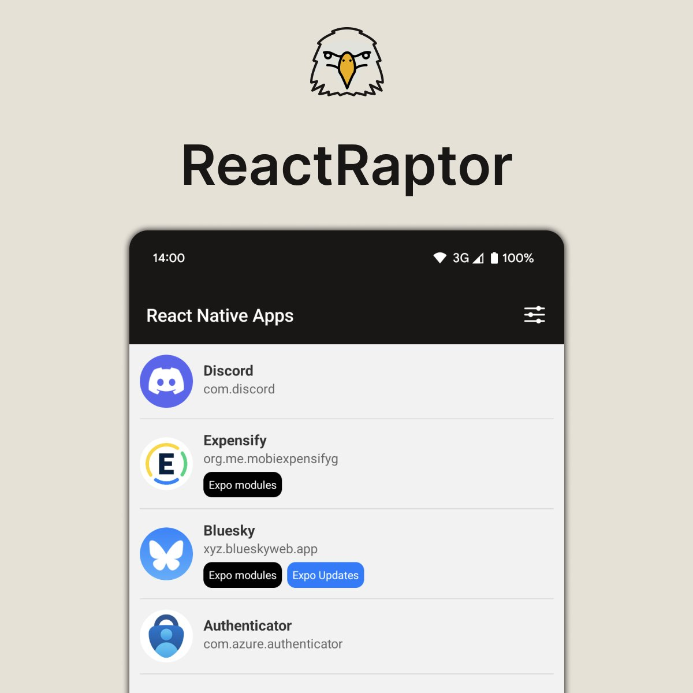

# ReactRaptor

ReactRaptor is an app made for React Native developers and enthusiasts. It analyzes your Android device to identify which apps are built using React Native and/or Expo.

## Features

- Scans your Android device for installed applications.
- Identifies apps built with React Native or Expo.
- Provides detailed insights into the compiled libraries, permissions and expo config used by these apps.

## Custom Expo Module

ReactRaptor is powered by a custom Expo module, [expo-android-app-list](https://github.com/leonhh/expo-android-app-list). It is specifically developed for this app. This module leverages the `QUERY_ALL_PACKAGES` permission to fetch a list of installed applications.

## Technical Details

This app is built with [Expo](https://expo.dev/) along with other great packages such as:

- [react-native-mmkv](https://github.com/mrousavy/react-native-mmkv) for fast and efficient storage.
- [expo-router](https://expo.github.io/router/) for navigation.
- [@tanstack/react-query](https://tanstack.com/query/latest) for async expo modules calls and caching.
- [zustand](https://github.com/pmndrs/zustand) for state management.
- [react-native-reanimated](https://docs.swmansion.com/react-native-reanimated/) for animations.

## Download

ReactRaptor is available on the Google Play Store. Check it out and discover which apps on your device are built with React Native/Expo:
[ReactRaptor on Google Play](https://play.google.com/store/apps/details?id=com.leonhh.reactraptor)
